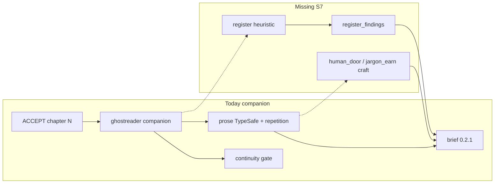
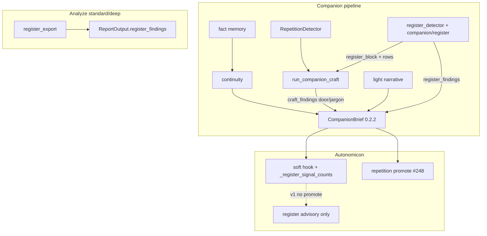

# Design: Unearned-jargon / human-door companion watch (Ghostreader#7 / Autonomicon #265 S7)

| Field | Value |
| --- | --- |
| **Author** | GhostReader craft design (Grok Build) |
| **Date** | 2026-09-25 |
| **Status** | Draft rev 2 (review round 1 addressed) |
| **Plan id** | `d4440445` |
| **Issue** | [Shinran7/Ghostreader#7](https://github.com/Shinran7/Ghostreader/issues/7) — Unearned-jargon / human-door companion watch |
| **Parent seat** | Autonomicon [#265](https://github.com/deftai/Autonomicon/issues/265) S7 (outside Autonomicon product dual-stop) |
| **Repos** | GhostReader primary (`C:\Users\shinr\Projects\GhostReader`); Autonomicon soft consume (`C:\Users\shinr\Projects\Autonomicon`) |
| **Durable copy (intended)** | `GhostReader/docs/plans/design-d4440445-7-jargon-human-door-watch.md` (create `docs/plans/` if needed) |
| **Autonomicon pointer (intended)** | `Autonomicon/docs/plans/design-d4440445-7-jargon-human-door-watch.md` → points at Ghostreader#7 + durable GR path |
| **Delivery** | Direct-to-`master` YOLO slices. No `gh pr create`. "## PR Plan" = ordered master commits across GhostReader then Autonomicon as needed. |
| **Voice** | Zinsser for Overview / Key Decisions. Paths and function names stay concrete for implementers. |
| **Evidence** | Shatterbound `stories/shatterbound/chapters/chapter-001.md` (Autonomicon tree) |
| **Parent SoT** | `Autonomicon/docs/plans/design-ceffffb7-265-shatterbound-lessons-rich-middle.md` (§3.3, S7) |

---

## Overview

Shatterbound chapter 1 is crafted and unreadable. Ritual, cue-codes, and sacred objects arrive before the reader has a human door. Continuity held. Story did not invite anyone in.

Autonomicon #265 already fixed the Writer side: rich-middle register, story-over-jargon prompts, initiation budget **3 coined nouns / first 300 words**. That is prompt pressure only. GhostReader still needs to notice when the page fails the reader anyway.

This design is the S7 seat only. Advisory companion watch. Not Review HOLD. Not a default hard chapter fail. Continuity stays king. Story stays queen. Rich middle stays the aesthetic. Zinsser is the anti-bias guardrail, not a thinness command.

GhostReader owns detection and the brief contract. Autonomicon soft-consumes additive fields the same way it did for #248 `repetition_findings`: ignore unknown keys today; fail-soft when the field is missing.

**Parent seat wording:** Autonomicon #265 S7 one-liner said “Post-book literary watch.” **This design supersedes that.** Progressive companion is primary (Shatterbound failed at the ch1 door; Autonomicon `--ghostreader-companion` is the in-pipeline witness). Analyze remains secondary end-of-book authority.

---

## Background & Motivation

### Reader evidence (Shatterbound ch1)

Opening window of `stories/shatterbound/chapters/chapter-001.md` loads institutional furniture before a clear want:

- Place/procedure nouns early: Ashfall Stair, writ-day, purge-list, stanchions, Spire.
- Coined/italic terms before teach-in: `*tobhandari*`, `*bhandari*-chain`.
- Kit inventory and auditor procedure as atmosphere (links, consecrated salt, purge-writ, sealing-tongs, Regulation pour).
- Human door arrives late: Renna’s daughter / four-coppers beat (~word 400+), after ritual theater is already running.

**v1 heuristic scope note:** Machine rows target italic/coined and institutional hyphens (`tobhandari`, `writ-day`, `purge-list`), **not** bare Title Case places (Ashfall Stair, Spire). Title Case / glossary stay deferred (KD-11 / former OQ-F). Soft `prose.human_door` / `prose.jargon_earn` still judge the full literary failure.

Autonomicon Writer now says (in `write-scene.j2`): open on one clear human want and one clear physical action; at most **3** unexplained coined content nouns in the opening **300** words (`craft_register_constants.py`). GhostReader must judge the published page, not re-implement that prompt as a hard gate.

### What GhostReader does today (verified)

| Surface | Path | Behavior | Gap for #7 |
| --- | --- | --- | --- |
| Companion brief | `ghostreader/companion/brief.py` `CompanionBrief` / `brief_to_payload` | Contract **`0.2.1`**; ship/watch; continuity + craft + narrative + `repetition_findings` | No register / jargon / human-door band |
| Verdict | `compute_verdict` / `compute_verdict_drivers` | Continuity concern, craft concern, or grounded narrative concern → `watch` | New watch must not invent Review HOLD or exit-2 continuity fail |
| Craft runner | `ghostreader/companion/craft.py` `run_companion_craft` | TypeSafe or LLM prose on focus chapter; repetition_block bias | Prose dims lack jargon-earn / human-door |
| TypeSafe prose | `ghostreader/typesafe/questions.py` `PROSE_DIMENSIONS` | `repetition`, `rhythm`, `show_vs_tell`, `dialogue`, `vocabulary` | `vocabulary` = diction fit, not initiation / human door |
| Light narrative | `companion_narrative_questions` | pacing + character_arcs only | No opening-door judgment |
| Algorithmic craft | `ghostreader/companion/repetition.py` + `analyzers/repetition_detector.py` | Machine `repetition_findings` for Autonomicon promote | Pattern to copy: detector + companion projection |
| Chapter load | `ghostreader/ingestion/markdown_loader.py` | `Chapter.content` = **full file including YAML frontmatter** | 300-word window must strip frontmatter first |
| HOOK contract | `ghostreader/companion/HOOK.md` | Autonomicon-facing JSON; additive fields documented | Needs 0.2.2 additive section |
| Analyze | `ghostreader/report/ANALYZE_HOOK.md` contract **0.2.0**; `cli.py` → `ReportOutput` → `json_export` | End-of-book craft/continuity authority; repetition via `analyze_repetition_findings` / `repetition_export.py` | Need parallel register export wire |
| Autonomicon hook | `Autonomicon/src/autonomicon/integrations/ghostreader_companion.py` | Opt-in post-ACCEPT; soft by default; hard gate = continuity only; `_craft_concern_count` scans findings only | Soft consume via new `_register_signal_counts`; no jargon hard-fail |
| #248 promote | `Autonomicon/src/autonomicon/integrations/companion_repetition_promote.py` | Fail-soft; missing field ≡ `[]`; never parses soft `craft_findings` | Template for optional later register promote |
| Initiation constants | `Autonomicon/src/autonomicon/agents/craft_register_constants.py` | `INITIATION_BUDGET_COINED_NOUNS = 3`, `INITIATION_BUDGET_WINDOW_WORDS = 300` | Shared numeric cousin; GR must not duplicate as Writer hard gate |



### Parent product locks (#265 / operator)

- Continuity is king; story is queen.
- Rich middle (not Hemingway-thin); Zinsser = anti-bias.
- S7 is advisory companion watch; not Review HOLD; not default hard chapter fail.
- Autonomicon #265 dual-stop product code is done; this design is S7 only.
- Sibling apps: GhostReader primary; Autonomicon soft consume of additive brief fields (pattern like #248).
- **Fire timing:** this design supersedes parent “post-book” seat wording (progressive primary; analyze secondary).

---

## Goals & Non-Goals

### Goals

1. **Notice reader failure** when published prose still dumps unearned jargon or opens without a human door.
2. **Fire early** on progressive companion (esp. chapter 1 / scene-1 openings) so mid-book debt does not pile up.
3. **Share judgment with analyze** so end-of-book cleanup sees register language: v1 analyze = **heuristic `register_findings` on standard/deep**; soft dims stay companion-primary (KD-11).
4. **Ship additive machine rows** (`register_findings`) plus soft craft ratings, without breaking Autonomicon parsers that ignore unknown keys.
5. **Align numbers with initiation budget 3/300** as a shared cousin; keep GR literary judgment richer than the Writer prompt rule.
6. **Stay advisory** under Autonomicon soft companion; never default-block chapters on register concerns.
7. **Test without live LLM** for heuristic + schema + verdict wiring dual-stop.

### Non-Goals

- No Shatterbound rewrite.
- No Review HOLD / Editor jargon classifier (still deferred from #265).
- No default Autonomicon hard-fail on jargon / human-door (no new `fail-on-register` in v1).
- No replacement of whole-book `ghostreader analyze`.
- No reopen of Autonomicon #265 product dual-stop (S0–S6).
- No promoting soft `craft_findings` text into Writer sinks (same rule as #248).
- No forcing thin `accessible` aesthetic via GR watches.
- No v1 machine `kind=missing_human_door` (human door is soft craft only).
- No v1 Title Case / glossary heuristic (KD-11 / former OQ-F).

---

## Proposed Design

### 1. When it fires (locked)

**Both surfaces, different jobs:**

| Surface | When | Job |
| --- | --- | --- |
| **Progressive companion** (primary) | Each `ghostreader companion <chapter.md>` when craft is on (not `--continuity-only`) | Early warning after ACCEPT; strongest signal on chapter 1 and each chapter’s opening window; heuristic rows **and** soft `prose.human_door` / `prose.jargon_earn` |
| **Analyze** (secondary) | `ghostreader analyze` at **`standard` and `deep` only** (not `quick`) when `analyze_register_watch` is on | EoB cleanup sees additive `register_findings` from per-chapter opening heuristics. Soft register dims are **companion-only in v1** (stock `PROSE_DIMENSIONS` stay five-pack) |

**Rationale:** Shatterbound failed at the door of ch1. Progressive companion is the only in-pipeline witness today (`--ghostreader-companion`). Analyze remains the EoB craft authority per GhostReader charter and Autonomicon end-of-book-cleanup skill. `workflow.py` quick = prose-only and is too thin for a second register soft-dim bank; heuristic export on standard/deep is enough for Goal 3 in v1.

**Kill switches (config) — land in S3:**

| Knob | Default | Role |
| --- | --- | --- |
| `companion_register_watch` | `true` | Master kill for companion heuristic + register TypeSafe/LLM dims |
| `analyze_register_watch` | `true` | Master kill for analyze heuristic register export |

When off: `register_findings` still present as `[]`; companion asks no register dims (S3 gates the ask). **S2 always merges register dims into `companion_prose_questions()`** (no flag yet); S3 wires the kill switch around that bank.

### 2. Additive brief fields + severity + quote/span

#### 2.1 Contract bump

Bump companion `GHOSTREADER_VERSION` in `ghostreader/companion/brief.py` from **`0.2.1` → `0.2.2`**.

Update `ghostreader/companion/HOOK.md` with an “Since 0.2.2” section. Document that **`register_findings` is JSON-primary** (like `repetition_findings`): `render_brief_markdown` / terminal do **not** need a machine-row section in v1; soft craft concerns still show under Craft. Optional markdown section is a later nicety.

Autonomicon continues to ignore unknown fields; missing `register_findings` ≡ `[]` on consume.

Analyze contract: additive `register_findings` on analyze JSON; **document in `ANALYZE_HOOK.md` without bumping `ANALYZE_JSON_VERSION` unless export tests prefer a bump** (KD-11 / former OQ-B).

#### 2.2 Machine-actionable rows: `register_findings`

Always present on companion JSON (empty list OK). Cap **15** rows (smaller than repetition’s 25; openings are local).

| Field | Type | Notes |
| --- | --- | --- |
| `kind` | `unearned_jargon` \| `initiation_budget` | Detector bucket. **No `missing_human_door` in v1** — human door lives only in soft `prose.human_door` craft |
| `severity` | `high` \| `moderate` \| `low` | Machine bands (cousin to repetition_findings) |
| `summary` | string | One-line human summary |
| `quote` | string \| null | Verbatim span from chapter N (required for `high`; preferred always) |
| `span_start_word` | int \| null | 0-based word offset over **stripped body** whitespace tokens |
| `span_end_word` | int \| null | Exclusive end word offset (same token space) |
| `term` | string \| null | Coined / institutional term when `kind=unearned_jargon` (null OK on `initiation_budget` aggregate row) |
| `window_words` | int | Window used (default 300; mirrors Autonomicon constant) |
| `coined_count` | int \| null | For `initiation_budget` rows: unexplained count in window |
| `budget` | int \| null | For `initiation_budget`: allowed unexplained count (default 3) |
| `chapter` | int | Focus chapter number |
| `normalized_key` | string \| null | Lowercased collapsed key for Autonomicon dedup |

**Soft craft findings** (human-facing, may flip `watch`):

- `prose.human_door` — sole v1 home for missing/late human door
- `prose.jargon_earn` — literary earned-jargon judgment (complements machine rows)

These land in existing `craft_findings` / `craft_ratings` with standard `PrioritizedFinding` shape (`severity`, `summary`, `evidence` quote, `chapter_ref`). Enrich path must supply a quote for concerns (reuse `enrich_findings_batch`). **Do not** project LLM concerns into `register_findings` in v1.

#### 2.3 Severity → verdict (locked)

| Band | Flips `verdict` to `watch`? | Exit `2` (`--fail-on-continuity`)? | Autonomicon hard-gate? |
| --- | --- | --- | --- |
| Gate continuity | Yes | Yes | Yes when fail-on-continuity |
| Soft craft (incl. new dims) | **Yes** (existing rule) | No | No |
| `register_findings` alone | **No** (machine rows do not flip by themselves) | No | No |
| Info continuity | Never alone | No | No |

**Why:** Match #248 split. Soft literary judgment can mark `watch` (worth a human glance) via craft concerns. Algorithmic rows stay machine-actionable without auto-escalating. Autonomicon soft hook already continues on `watch`.

`verdict_drivers`: register soft concerns stay under **`"craft"`** (KD-11). No `"register"` driver in v1.

### 3. How detectors work (heuristic + LLM craft)

**Locked: both.** Heuristic for reproducible initiation-budget cousin and term spans; TypeSafe/LLM for human-door and earned-jargon literary judgment. Heuristic output biases the craft prompt (same pattern as `repetition_block` in `run_companion_craft`).

#### 3.1 Shared numbers

`ghostreader/companion/register_constants.py`

```python
# Cousin of Autonomicon craft_register_constants.py — keep numbers in sync.
INITIATION_BUDGET_COINED_NOUNS = 3
INITIATION_BUDGET_WINDOW_WORDS = 300
REGISTER_FINDINGS_CAP = 15
```

Comment in both modules: “S7 / Ghostreader#7 — keep Autonomicon + GhostReader numbers identical.” Do **not** import across repos.

#### 3.2 Module split (locked; mirror repetition)

| Module | Role |
| --- | --- |
| `ghostreader/analyzers/register_detector.py` | Core heuristic: strip body, window, candidates, teach-in, emit raw findings |
| `ghostreader/companion/register.py` | Companion projection: cap, dict rows for brief, `register_block` bias string for craft |
| `ghostreader/companion/register_constants.py` | Shared numeric + denylist constants |
| `ghostreader/report/register_export.py` | Analyze-side aggregation (mirror `repetition_export.py`) |

#### 3.3 Frontmatter stripping (locked)

`markdown_loader.py` stores the **full file** in `Chapter.content`, including Autonomicon YAML (`chapter_number`, `title`, `date`, `word_count`). Counting those tokens corrupts the 300-word window and spans.

S0 ships:

```python
def strip_chapter_body(content: str) -> str:
    """Return prose body after YAML frontmatter (--- … ---). Idempotent if none."""
```

Place it next to the detector (prefer `analyzers/register_detector.py` or a tiny shared `ingestion` helper if one already fits). **Unit-test:** frontmatter keys (`chapter_number`, `word_count`, etc.) never appear in the opening window tokens. Document that `span_*_word` offsets are over **stripped** body whitespace tokens only.

#### 3.4 Heuristic detector (no LLM)

**Inputs:** `strip_chapter_body(chapter.content)`; glossary/seed terms **out of v1** (KD-11).

**Opening window:** first `INITIATION_BUDGET_WINDOW_WORDS` whitespace words of stripped body. On chapter 1, prompt bias for soft dims is stronger (KD-11); heuristic severity thresholds stay the same numbers book-wide unless a later operator reopens weighting.

**Candidate coined / institutional terms (v1 rules):**

1. Markdown/italic emphasis tokens (`*tobhandari*`).
2. Hyphenated content compounds that look institutional (e.g. `bhandari-chain`, `writ-day`, `purge-list`), **minus** an English-hyphen denylist.
3. **Not** bare Title Case place names in v1.

**English-hyphen denylist (S0 ships; extend as needed):**

```python
HYPHEN_DENYLIST = frozenset({
    "cold-forged",  # Shatterbound ch1 literal; English compound, not jargon
    "well-known",
    "well-worn",
    "long-term",
    "short-term",
    "two-turn",
    "half-bell",
    # …
})
```

**Teach-in heuristic (cheap, imperfect):** a term is “explained” in-window if a nearby appositive / “was called” / parenthetical gloss / “means” pattern appears within ±2 sentences. Unexplained candidates count toward budget.

**Emit:**

- One `initiation_budget` row when unexplained coined count **>** `INITIATION_BUDGET_COINED_NOUNS`, severity by overrun (`+1` → moderate, `≥+2` → high).
- Up to N `unearned_jargon` rows for top unexplained terms with quotes.
- **Never** emit `missing_human_door`. Optional internal `opening_signals` may feed the LLM bias block only (not a brief field).

**Shatterbound ch1 fixture expectation (dual-stop):** stripped opening window yields `initiation_budget` and/or `unearned_jargon` with quotes for `tobhandari` / `writ-day` / `purge-list` (or equivalent italic/institutional hyphens). Assert **`cold-forged` is not** an `unearned_jargon` term. Do not require Title Case place hits.

#### 3.5 TypeSafe / LLM craft dimensions

Extend companion prose path (do **not** silently overload `prose.vocabulary`). Keep stock analyze `PROSE_DIMENSIONS` as the five-pack.

```python
# ghostreader/typesafe/questions.py
COMPANION_REGISTER_DIMENSIONS: tuple[str, ...] = (
    "prose.human_door",
    "prose.jargon_earn",
)

_COMPANION_REGISTER_INSTRUCTIONS = {
    "prose.human_door": (
        "Rate whether THIS CHAPTER opens with a clear human want and a trackable "
        "physical action the reader can hold BEFORE institutional language, ritual "
        "procedure, or unexplained coined terms earn weight. Concern = missing or "
        "late human door (especially chapter 1). Strength = door is clear and early. "
        "Rich description is allowed; unpaid jargon-before-door is not."
    ),
    "prose.jargon_earn": (
        "Rate whether coined / institutional terms and ritual or auditor procedure "
        "are taught in use. Concern = unearned jargon dumps, sacred objects without "
        "frame, or procedure theater as atmosphere. Do not punish earned lore, "
        "short lyric beats that advance feeling, or a character performing bureaucracy "
        "on purpose. Align with initiation budget spirit: few unexplained coined "
        "content nouns in the opening window."
    ),
}

def companion_prose_questions() -> dict[str, Any]:
    """Base five prose dims + register dims (always merged in S2)."""
    ...
```

**Wiring (companion):**

- **S2:** `companion_prose_questions()` **always** returns base five + two register dims. `run_companion_craft` / `_companion_prose_typesafe_path` use that bank (and matching dimension list for `choices_to_findings`), not stock `prose_questions()` alone.
- **S2 LLM-only path:** `_companion_prose_llm_path` must **name** `prose.human_door` and `prose.jargon_earn` in companion-local system/user text (do not rely on stock `_SYSTEM_PROMPT_TEMPLATE` five-dim list). Prefer a companion-local template fragment or explicit append; **keep stock analyze LLM prompt unchanged**.
- Pass a `## Register heuristic` block into craft user/context (like `_COMPANION_REP_BIAS` + repetition_block).
- **S3:** when `companion_register_watch` is false, skip heuristic, emit `register_findings=[]`, and call stock `prose_questions()` / five dims only (kill switch around the S2 always-on bank).

**Wiring (analyze) — S3 checklist (locked):**

1. `ghostreader/report/register_export.py` — aggregate per-chapter opening heuristic rows (mirror `repetition_export.py`).
2. `ReportOutput.register_findings` in `ghostreader/report/__init__.py` + `json_export.py` always emit the key (empty OK).
3. Wire from `cli.py` analyze path beside `analyze_repetition_findings` (same chokepoint pattern).
4. Gate on `analyze_register_watch` and depth ∈ `{standard, deep}` — **not** `quick`.
5. Document additive field in `ANALYZE_HOOK.md` (no version bump required unless tests want it).
6. **Analyze v1 = heuristic rows only.** Soft `prose.human_door` / `prose.jargon_earn` stay companion-only; do not extend stock `PROSE_DIMENSIONS`, `ALL_CHOICE_DIMENSIONS`, or `compare.py` `_DIMENSIONS` in v1.

**Named exceptions** (prompt text must include): short lyric that advances feeling; term taught in use; character performing bureaucracy on purpose. Matches Writer story-over-jargon exceptions so GR does not fight Autonomicon aesthetic.

**Chapter-1 prompt bias (KD-11):** companion register instructions (and register_block header) add one short stronger line when `chapter_number == 1` (“chapter 1 openings are held to the strictest human-door / initiation bar”). Heuristic numeric thresholds unchanged.

### 4. Autonomicon handoff

#### 4.1 v1 locked: advisory soft consume only

Pattern after #248, **without** Writer promote in v1:

1. GhostReader ships `register_findings` + craft dims + HOOK.md 0.2.2.
2. Autonomicon:
   - Continues saving `stories/{slug}/reports/ghostreader-companion-chNNN.json`.
   - Adds **`_register_signal_counts(brief) -> …`** in `ghostreader_companion.py` (fail-soft). Counts `register_findings` with severity `high`/`moderate`, plus craft **findings and/or ratings** for dims `prose.human_door` / `prose.jargon_earn` when severity=`concern`. Missing key ≡ zeros. **Do not** overload `_craft_concern_count` or feed the continuity hard gate.
   - Updates `docs/ghostreader-companion.md` + optionally a one-line cross-link in #265 SoT §3.3 (note progressive-primary supersession).
   - **No** new escalate path. **No** `fail-on-register`. Missing field ≡ `[]`.

#### 4.2 Optional promote (out of v1; follow-up only)

If operator later wants mid-book Writer pressure:

| Sink idea | Content | Risk |
| --- | --- | --- |
| Avoid ledger | Exact unearned terms from `register_findings` | Can ban load-bearing motif nouns |
| Governor guidance | “Open on want + action; teach coined terms in use” | Soft; safer |
| Chapter-1-only extra | Stronger story-over-jargon reminder on next ch1 rewrite only | Narrow |

Recommendation if promoted later: **governor-style guidance only**, never exact-term bans from register rows without a protected-motif filter (reuse `is_companion_phrase_protected` ideas). Still fail-soft. Still never parse soft craft prose into sinks. **v1 line = no promote** (KD-11).

### 5. Relationship to existing craft / continuity / TypeSafe

| System | Relationship |
| --- | --- |
| Continuity gate dims | Untouched. Register never feeds `--fail-on-continuity`. |
| Info dims (foreshadowing/unresolved) | Untouched. Register is not info-only; soft craft can flip watch. |
| Light narrative | Untouched. Human door is prose/register, not pacing/arcs. |
| `repetition_findings` | Sibling machine array. Separate promote path. Do not merge schemas. Same JSON-primary render posture. |
| `prose.vocabulary` | Stays diction-fit. Do not overload it for initiation budget. |
| Stock `PROSE_DIMENSIONS` | Stay five-pack on analyze. Companion uses `companion_prose_questions()`. |
| TypeSafe Choice | New companion register dims use same `SEVERITY_CRITERIA` strength/neutral/concern. |
| TypeSafe enrich | Concerns must get quotes; empty-evidence concerns demote or stay low-trust per existing enrich policy. |
| Charter (literary vs surface hygiene) | Register watch is literary judgment (earned lore / human door), not GhostCopyeditor garble. |



### 6. Dual-stop slices and tests (no live LLM where possible)

See ## PR Plan for ordered YOLO slices. Dual-stop rules:

- **Success:** GhostReader S0–S3 green with unit tests; Autonomicon S4 docs/log consume green; S5 not in v1 default line.
- **Failure:** Two unsuccessful fix attempts on the same slice, or ~90 minutes wall without progress → stop and report.
- **Non-blockers:** live companion smoke on Shatterbound ch1; operator bake-off; promote path.

**Fixture strategy:** Vend `GhostReader/tests/fixtures/register/shatterbound-ch1-opening.md` **with YAML frontmatter** (first ~400–500 words from Autonomicon evidence chapter + attribution comment) so strip tests are real. Do not require Autonomicon checkout for GR CI.

### 7. Alignment with initiation budget 3/300 (without duplicating Writer hard gate)

| Layer | Role | Enforcement |
| --- | --- | --- |
| Autonomicon Writer | `write-scene.j2` + `craft_register_constants.py` | Prompt-only |
| GhostReader heuristic | Same numbers in `register_constants.py` | Advisory machine rows |
| GhostReader TypeSafe/LLM | Literary human_door / jargon_earn | Advisory craft; may `watch` |
| Autonomicon hook | Soft consume via `_register_signal_counts` | Log only in v1 |
| Review / Editor | Out of scope | No HOLD |

GR may flag a chapter the Writer prompt “allowed” if teach-ins are fake or the human door is still missing. That is intended. GR must not become a second hard floor that rejects rich-middle prose that earns its keep.

---

## API / Interface Changes

### GhostReader CLI

No new subcommand. Existing:

```text
ghostreader companion chapter-NNN.md --format json
ghostreader analyze chapters/ --depth standard --format json
```

Config knobs added in **S3** to `config.yaml` / `ghostreader/config.py` `GhostreaderConfig`:

- `companion_register_watch: true`
- `analyze_register_watch: true`

`--continuity-only` continues to skip craft **and** register heuristic/dims (register is craft-adjacent).

### Companion JSON (0.2.2) additive example

```json
{
  "ghostreader_version": "0.2.2",
  "register_findings": [
    {
      "kind": "initiation_budget",
      "severity": "high",
      "summary": "6 unexplained coined/institutional nouns in first 300 words (budget 3).",
      "quote": "The wind was tobhandari, wet soot off the slag-hills",
      "span_start_word": 0,
      "span_end_word": 300,
      "term": null,
      "window_words": 300,
      "coined_count": 6,
      "budget": 3,
      "chapter": 1,
      "normalized_key": "initiation_budget:1"
    },
    {
      "kind": "unearned_jargon",
      "severity": "moderate",
      "summary": "Coined term appears before teach-in.",
      "quote": "The wind was tobhandari, wet soot off the slag-hills",
      "span_start_word": 90,
      "span_end_word": 98,
      "term": "tobhandari",
      "window_words": 300,
      "coined_count": null,
      "budget": null,
      "chapter": 1,
      "normalized_key": "tobhandari"
    }
  ],
  "craft_ratings": [
    {"dimension": "prose.human_door", "severity": "concern", "note": "Want arrives after ritual kit and auditor procedure."},
    {"dimension": "prose.jargon_earn", "severity": "concern", "note": "Institutional nouns arrive unexplained in the opening window."}
  ]
}
```

### Autonomicon

- `ghostreader_companion.py`: add `_register_signal_counts(brief)`; log; no CLI flag in v1; do not overload `_craft_concern_count`.
- Docs only + fail-soft awareness in consume notes.
- Optional future: `companion_register_promote.py` (not v1).

---

## Data Model Changes

| Artifact | Change |
| --- | --- |
| `CompanionBrief` dataclass | Add `register_findings: list[dict[str, Any]] = field(default_factory=list)` |
| `brief_to_payload` | Always emit `register_findings` (JSON-primary; markdown/terminal may omit machine rows) |
| `GHOSTREADER_VERSION` | `0.2.2` |
| `GhostreaderConfig` | Two bool knobs (S3) |
| `ReportOutput` | Additive `register_findings` |
| Analyze export | `register_export.py` + `json_export` + `ANALYZE_HOOK.md` note |
| Autonomicon reports JSON | Pass-through; no schema file required |
| Canon style JSON | No v1 writes from register |

---

## Alternatives Considered

### A1. Analyze-only (no progressive companion)

- **Pros:** One literary pass; less companion latency.
- **Cons:** Misses ch1 early warning; Autonomicon mid-book hook unused; Shatterbound failure mode is opening-door.
- **Decision:** Reject as sole path. Analyze remains secondary.

### A2. Overload `prose.vocabulary` instead of new dims

- **Pros:** No dimension list growth.
- **Cons:** Mixes diction-fit with initiation/human-door; muddy TypeSafe criteria; hard to promote later.
- **Decision:** Reject. Add `prose.human_door` + `prose.jargon_earn`.

### A3. Heuristic-only (no TypeSafe)

- **Pros:** Free, deterministic CI.
- **Cons:** Cannot judge “human door” well; false positives on earned compounds; fights rich middle.
- **Decision:** Reject as sole path. Keep heuristic for budget cousin + quotes.

### A4. Soft info-only band (never flips watch)

- **Pros:** Quieter companion.
- **Cons:** Operator asked for a watch that notices reader failure; craft-concern→watch already means glance, not fail.
- **Decision:** Reject for soft literary dims. Machine `register_findings` alone still do not flip watch.

### A5. Autonomicon hard-fail env in v1 (`fail-on-register`)

- **Pros:** Teeth.
- **Cons:** Violates locked advisory seat; risks blocking rich-middle books on heuristic noise.
- **Decision:** Reject for v1.

### A6. Editor classifier + Review HOLD

- **Pros:** In-pipeline Autonomicon gate.
- **Cons:** Explicit #265 non-goal; Editor deferred.
- **Decision:** Out of scope (same as parent A6).

### A7. Project `prose.human_door` concern into `register_findings` (`kind=missing_human_door`)

- **Pros:** One machine array for Autonomicon.
- **Cons:** Couples LLM enrich timing to machine schema; thicker v1; dead-enum risk if projection skipped.
- **Decision:** Reject for v1. Drop `missing_human_door` kind; human door is soft craft only.

### A8. Analyze soft register dims in v1 (extend stock `PROSE_DIMENSIONS`)

- **Pros:** Full literary parity on EoB.
- **Cons:** Touches `prose_analyst.py`, `ALL_CHOICE_DIMENSIONS`, `compare.py`; thrash risk on S3; quick depth ambiguity.
- **Decision:** Reject for v1. Analyze = heuristic export on standard/deep only.

---

## Security & Privacy

- No new network surfaces; uses existing LLM / TypeSafe keys.
- Fixtures must not include secrets; Shatterbound excerpt is story prose only.
- No glossary/sibling-path discovery in v1 (reduces filesystem surprise).
- Do not shell out to Autonomicon from GhostReader tests.

---

## Observability

| Signal | Where |
| --- | --- |
| stderr progress | `Running register watch…` + kept row count (mirror craft repetition logs in `pipeline.py`) |
| Brief fields | `register_findings` (JSON), craft ratings for new dims, `ghostreader_version=0.2.2` |
| Autonomicon log | via `_register_signal_counts`: high/moderate register rows + human_door/jargon_earn concern flags |
| Warnings | Heuristic parse issues append to `warnings` (non-fatal) |

---

## Rollout Plan

1. Land GhostReader heuristic + strip helper + denylist + schema + HOOK on `master` (YOLO).
2. Land TypeSafe + companion LLM dim naming (S2 always-on bank).
3. Land pipeline kill switches + analyze heuristic export (standard/deep).
4. Smoke: `ghostreader companion` on Shatterbound `chapter-001.md --format json` (operator/non-blocker for dual-stop).
5. Land Autonomicon `_register_signal_counts` + docs pointer.
6. Promote stays a later follow-up, not v1 dual-stop.

---

## Risks

| Risk | Severity | Mitigation |
| --- | --- | --- |
| Heuristic false positives on earned English hyphens | Med | S0 denylist includes `cold-forged`; TypeSafe can rate neutral/strength; machine rows alone do not flip watch |
| Craft concern→watch rate rises on dense openings | Med | Intended for ch1 failures; kill switch `companion_register_watch`; rich-middle exceptions in prompts |
| Constant drift 3/300 vs Autonomicon | Low | Comments + twin constants modules; unit test asserts GR constants == expected literals |
| Frontmatter shifts window | Med | `strip_chapter_body` + fixture-with-frontmatter tests |
| Latency (+2 TypeSafe Choices on companion) | Low–Med | Small batch; skip under `--continuity-only`; kill switch |
| Operators treat watch as chapter failed | Med | HOOK.md + Autonomicon docs: watch ≠ fail; continuity hard-gate unchanged |
| Implementers follow parent “post-book” only | Low | Overview + KD-1 supersession sentence |
| Promote later bans motif nouns | Med | v1 no promote; if promote, governor-only + protected stems |

---

## Open Questions

Former OQ-A–F recommended defaults are **absorbed into KD-11** for YOLO. Remaining true follow-ups:

1. **OQ-Promote —** After first next-book companion smoke under rich-middle Writer, schedule governor-style register promote? (Default now: **no** until that smoke.)
2. **OQ-Hard-fail —** Ever add opt-in `fail-on-register`? (Default now: **no**; advisory seat holds.)
3. **OQ-Analyze-soft —** Later extend analyze with soft register dims / `analyze_prose_questions()`? (Default now: **no** for v1 line.)
4. **OQ-Glossary —** Add seed/glossary + Title Case candidates after denylist proves stable? (Default now: **later**.)

---

## Key Decisions

1. **KD-1 — Progressive companion is the primary fire path; analyze is secondary.** This design **supersedes** the parent #265 S7 “post-book literary watch” one-liner. Catch the door failure early. Analyze remains EoB heuristic authority for register rows.

2. **KD-2 — Advisory only.** Soft craft may set `watch`. Machine rows do not hard-fail. No Review HOLD. No default Autonomicon chapter block.

3. **KD-3 — Both detectors.** Heuristic owns the 3/300 cousin and quotes. TypeSafe/LLM owns human door and earned jargon.

4. **KD-4 — Additive brief field `register_findings` on companion contract 0.2.2.** Kinds are only `unearned_jargon` and `initiation_budget`. Human door is **only** soft `prose.human_door` (no machine `missing_human_door`). Soft jargon dim is `prose.jargon_earn`. JSON-primary (markdown/terminal may omit machine rows).

5. **KD-5 — Do not overload `prose.vocabulary`.** Keep diction-fit separate from register. Stock analyze `PROSE_DIMENSIONS` stay five-pack.

6. **KD-6 — Numbers stay 3 / 300.** Twin constants modules; prompt-only on Writer; advisory on GR. Word offsets are over **stripped** body tokens.

7. **KD-7 — Autonomicon v1 = `_register_signal_counts` log + docs, no promote.** Do not overload `_craft_concern_count`.

8. **KD-8 — Rich middle preserved.** Named exceptions match Writer story-over-jargon. Zinsser guards sludge, not beauty.

9. **KD-9 — YOLO on master.** GhostReader first, Autonomicon consume second. Dual-stop without live LLM for heuristic/schema/verdict tests.

10. **KD-10 — Continuity hard-gate unchanged.** Register never feeds `--fail-on-continuity` / exit 2.

11. **KD-11 — Implement recommended former OQ defaults (no YOLO stall):**
    - **A:** Analyze register export on **`standard` + `deep` only** (not `quick`).
    - **B:** Analyze `register_findings` **additive** in `ANALYZE_HOOK.md`; bump `ANALYZE_JSON_VERSION` only if export tests prefer it.
    - **C:** Soft register concerns stay under verdict driver **`"craft"`**.
    - **D:** **No** Autonomicon promote in v1 line.
    - **E:** Stronger **chapter-1 prompt/bias text only**; heuristic numeric thresholds book-wide.
    - **F:** **No** glossary / Title Case candidates in v1; denylist + italic/institutional hyphens only.

12. **KD-12 — Module split mirrors repetition.** Detector `analyzers/register_detector.py`; companion projection `companion/register.py`; constants `companion/register_constants.py`; analyze `report/register_export.py`.

13. **KD-13 — S2 always merges companion register dims; S3 owns kill switches.** S2 dual-stop does not require config flags. Companion LLM path must name the two new dims in S2.

---

## PR Plan

Ordered YOLO slices on `master`. No GitHub PRs.

### S0 — Constants + detector split + strip + denylist + fixture tests
- **Title:** `feat(companion): #7 register heuristic + 3/300 constants`
- **Repo:** GhostReader
- **Files:** `ghostreader/companion/register_constants.py` (incl. `HYPHEN_DENYLIST` with `cold-forged`); `ghostreader/analyzers/register_detector.py` (`strip_chapter_body`, core heuristic); `ghostreader/companion/register.py` (projection + `register_block`); `tests/fixtures/register/shatterbound-ch1-opening.md` **with frontmatter**; `tests/test_companion_register.py`
- **Dependencies:** none
- **Dual-stop:** Strip test (frontmatter keys absent from window); fixture yields `initiation_budget` and/or `unearned_jargon` with quotes for italic/institutional hyphens; `cold-forged` not an unearned term; constants == 3 and 300; cap respected. No live LLM.

### S1 — Brief schema 0.2.2 + HOOK.md
- **Title:** `feat(companion): #7 register_findings on brief contract 0.2.2`
- **Repo:** GhostReader
- **Files:** `ghostreader/companion/brief.py` (`CompanionBrief`, `brief_to_payload`, `GHOSTREADER_VERSION`); `ghostreader/companion/HOOK.md` (Since 0.2.2; kinds; **JSON-primary** note); `tests/test_companion_brief.py`
- **Dependencies:** S0 helpful (rows shape)
- **Dual-stop:** Payload always includes `register_findings` (default `[]`); kinds only `unearned_jargon` \| `initiation_budget`; version `0.2.2`; existing verdict tests still green.

### S2 — TypeSafe + companion LLM register dimensions (always-on bank)
- **Title:** `feat(typesafe): #7 prose.human_door + prose.jargon_earn companion questions`
- **Repo:** GhostReader
- **Files:** `ghostreader/typesafe/questions.py` (`COMPANION_REGISTER_DIMENSIONS`, `companion_prose_questions`); `ghostreader/companion/craft.py` (TypeSafe path uses extended bank + register_block bias; **`_companion_prose_llm_path` names both new dims** via companion-local template/append); unit tests for question keys + LLM prompt fragment contains both dim strings
- **Dependencies:** S1
- **Dual-stop:** Question bank includes both dims; companion craft TypeSafe **and** LLM paths use extended bank (always merged; no config flag yet). Stock analyze prompt unchanged. No live TypeSafe required.

### S3 — Pipeline kill switches + analyze heuristic export
- **Title:** `feat(companion): #7 wire register watch into pipeline + analyze export`
- **Repo:** GhostReader
- **Files:** `ghostreader/companion/pipeline.py`; `ghostreader/config.py`; `config.yaml` (`companion_register_watch`, `analyze_register_watch`); `ghostreader/report/register_export.py`; `ghostreader/report/__init__.py` (`ReportOutput.register_findings`); `ghostreader/report/json_export.py`; `ghostreader/cli.py` (analyze wire beside repetition findings; depth gate standard/deep); `ghostreader/report/ANALYZE_HOOK.md`; pipeline/export tests with stubs
- **Dependencies:** S0–S2
- **Dual-stop:** Watch on + stubbed craft → brief carries heuristic rows + register craft dims; `--continuity-only` / kill switch → `[]` and stock five dims; analyze standard/deep emits `register_findings`; analyze quick does not run register export (or emits `[]` by depth gate). Soft dims not added to stock analyze prose.

### S4 — Autonomicon soft consume + docs pointer
- **Title:** `docs(integrations): #7 / Ghostreader#7 soft consume register_findings`
- **Repo:** Autonomicon
- **Files:** `src/autonomicon/integrations/ghostreader_companion.py` (`_register_signal_counts` + log; do not overload `_craft_concern_count`); tests for missing key ≡ zeros; `docs/ghostreader-companion.md`; `docs/plans/design-d4440445-7-jargon-human-door-watch.md` pointer; optional §3.3 cross-link on #265 SoT noting progressive-primary supersession
- **Dependencies:** GR S1+ landed or fail-soft missing field
- **Dual-stop:** Missing `register_findings` does not throw; helper unit-tested; no promote; no new hard-gate flag.

### S5 — Optional promote (follow-up only; not v1 dual-stop)
- **Title:** `feat(integrations): Ghostreader#7 register governor promote (fail-soft)`
- **Repo:** Autonomicon
- **Files:** new `companion_register_promote.py`; wire from `nodes_update.py` beside repetition promote; tests with protected-motif skips
- **Dependencies:** S4 + explicit operator promote lock
- **Dual-stop:** Missing field ≡ no-op; governor guidance only; never escalate.

---

## Dual stop (this design’s implementation)

- **Success:** S0–S3 on GhostReader `master` with unit/fixture tests green without live LLM; S4 Autonomicon soft consume landed.
- **Failure:** Two unsuccessful fix attempts on the same slice, or ~90 minutes wall without progress → stop and report. Do not add Review HOLD, hard-fail-on-register, or Writer prompt deletion to go green.
- **Non-blockers:** live Shatterbound ch1 companion smoke; next-book bake-off; Salt Ledger re-forge (still operator-gated under #265 OQ-6); S5 promote.

---

## References

- Issue: https://github.com/Shinran7/Ghostreader/issues/7
- Parent: https://github.com/deftai/Autonomicon/issues/265 (§3.3 / S7)
- Parent design: `C:\Users\shinr\Projects\Autonomicon\docs\plans\design-ceffffb7-265-shatterbound-lessons-rich-middle.md`
- Initiation constants: `C:\Users\shinr\Projects\Autonomicon\src\autonomicon\agents\craft_register_constants.py`
- Writer block: `C:\Users\shinr\Projects\Autonomicon\src\autonomicon\prompts\writer\write-scene.j2` (Story over jargon)
- Evidence: `C:\Users\shinr\Projects\Autonomicon\stories\shatterbound\chapters\chapter-001.md`
- Companion brief / HOOK: `C:\Users\shinr\Projects\GhostReader\ghostreader\companion\brief.py`, `HOOK.md`
- Craft / pipeline: `C:\Users\shinr\Projects\GhostReader\ghostreader\companion\craft.py`, `pipeline.py`
- Markdown load: `C:\Users\shinr\Projects\GhostReader\ghostreader\ingestion\markdown_loader.py`
- TypeSafe questions: `C:\Users\shinr\Projects\GhostReader\ghostreader\typesafe\questions.py`
- Analyze export pattern: `C:\Users\shinr\Projects\GhostReader\ghostreader\report\repetition_export.py`, `json_export.py`, `cli.py`
- #248 pattern: `C:\Users\shinr\Projects\Autonomicon\src\autonomicon\integrations\companion_repetition_promote.py`
- Autonomicon hook: `C:\Users\shinr\Projects\Autonomicon\src\autonomicon\integrations\ghostreader_companion.py`
- Autonomicon docs: `C:\Users\shinr\Projects\Autonomicon\docs\ghostreader-companion.md`

---

## Revision history

- **Rev 1:** Initial S7 design.
- **Rev 2 (2026-09-25):** Addressed review round 1. Dropped `missing_human_door` machine kind; locked analyze wire (heuristic-only on standard/deep) + KD-11 OQ defaults; `strip_chapter_body` + denylist incl. `cold-forged`; S2 always-on dims / S3 kill switches; companion LLM dim naming; repetition-style module split; JSON-primary docs; Autonomicon `_register_signal_counts`; superseded parent “post-book” wording.
